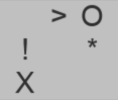
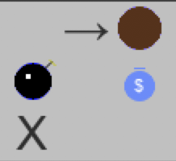

# Gridworld

Implementation of an array based grid which facilitates 
easy creation of grid based games and applications 
using Pygame.

## Installation
pip install git+https://github.com/hpharmsen/gridworld

## Usage

### Creating the grid
To create a 10x10 grid of 30x30 pixel cells:
```python
from grid import Grid
grid = Grid(10, 10, 30, 30)
```

### Setting cells
Setting a cell is as easy as filling in character in the 2D array.

```python
from gridworld import Grid, draw_character_cell, TOP

grid[0, 0] = 'A'
```

### Basic example: Tic Tac Toe
```python
grid = Grid(3, 3, 90, 90, title='Tic Tac Toe', margin=1)
grid[0, 0] = 'O'
grid[1, 1] = 'X'
grid[2, 1] = 'O'
grid[2, 2] = 'X'
grid.run()
```


### More parameters to to the constructor
The first four parameters are positional and thus obligatory.

width, height, cellwidth and cellheight.

The rest are optional:
```python
margin = 0                # Margin width between cells in pixels\
title = ''                # Window title
itemcolor=DARKGRAY        # Color of the characters in the cells
cellcolor=LIGHTGRAY       # Background color of the cells
margincolor=DARKGRAY      # Color of the margins between the cells
itemfont=None             # Font used for the characters in the cells. Default is the system font.
framerate=60              # Maximum frame rate (see Pygame documentation)
statusbar_position = NONE # Extra space next to the cells. TOP, LEFT, BOTTOM or RIGHT.
statusbar_size = 0        # Size of the extra space in pixels
full_screen = False       # Whether to start in full screen mode
```

### Prettier looks
By default the grid shows the characters that you set in the cells. Lik this:

 \
_grid showing literal characters_

You can however overwrite this default behaviour like this

```python
# draw_character_cell is provided by gridword to substitute another character
grid.set_drawaction('>', partial(draw_character_cell, character='→'))

# But you can als implement your own drawing functions
grid.set_drawaction('O', draw_boulder)
grid.set_drawaction('!', draw_bomb)
grid.set_drawaction('*', draw_money)
```
Such a drawing function gets grid and cell_dimensions as parameters.

```python
def draw_boulder(grid, cell_dimensions):

    # Background
    pygame.draw.rect(grid.screen, GREY, cell_dimensions)
    
    # Circle
    x, y, w, h = cell_dimensions
    pygame.gfxdraw.filled_circle(grid.screen,  x + w/2, y + h/2, w*4/5, BROWN)
```
 \
_characters replaced by drawings_

### User input
To interact with the grid you have four methods you can overload
```python
grid.set_key_action(my_key_action) 
# Pass a function that expects a key core
# Function will be called when a key is pressed. 
# Parameter key is the Pygame key code.

grid.set_mouse_click_action(my_mouse_click_action) 
# Pass a function that expects (x,y) coo tuple which is the position (in pixels) of the click
# Function will be called whenever the window receives a mouse click

grid.set_cell_click_action(my_handle_cell_click)  
# Pass a function that expects (x,y) tuple which is the cell clicked
# Function will be called whenever the window receives a mouse click

grid.set_timer_action(my_frame_action) 
# Pass a function that expects parameters
# Function will be called once every frame. 

grid.set_update_statusbar_action( my_update_statusbar) 
# Pass a function that expects no parameters        
# Function will be called whenever the screen is redrawn. 
# Gives you the possibility to update the contents of the statusbar


```
For example, here's an implementation of responding to cursor keys or quitting whenever 'q' is pressed.
```python
def my_key_action(key):
    if key == pygame.K_q:
        sys.exit()
    else:
        moves = {pygame.K_LEFT: (-1, 0), pygame.K_RIGHT: (1, 0), pygame.K_UP: (0, -1), pygame.K_DOWN: (0, 1)}
        movement = moves.get(key)
        if movement:
            my_move(movement)
```


### Screen updating
GridWorld has two parameters that control how the screen is updated:

***update_fullscreen***\
When set to True (default) the whole screen is updated (pygame.flip) with each update.\
When set to False for only the effected area is redrawn. This is faster when updating a single cell. When updating multiple cells at once a full flip is usually faster.
        
***update_automatic***\
When set to True (default) the screen is updated every time a value in the grid is changed.,
You might want to turn this off (temporarily) e.g. when loading a level.
